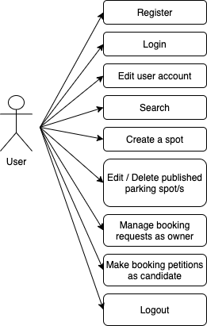
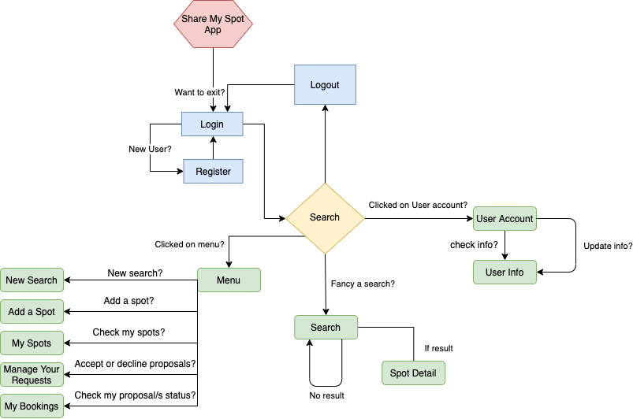
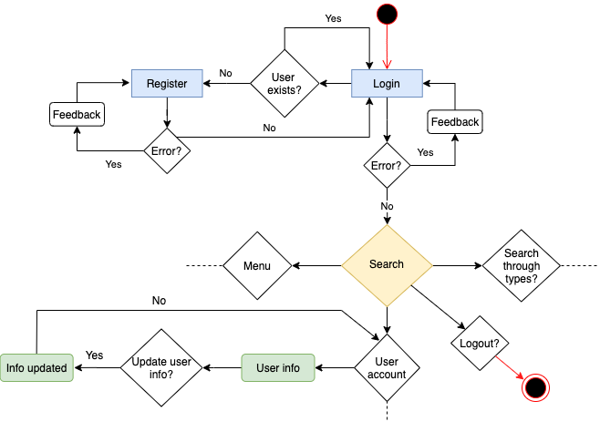
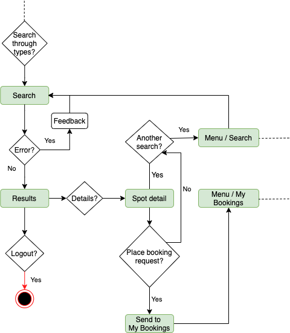
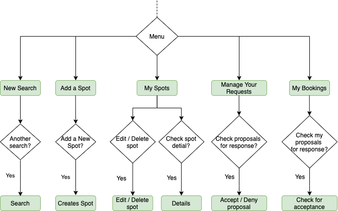
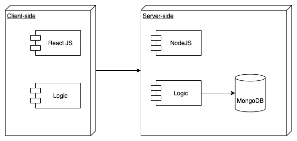
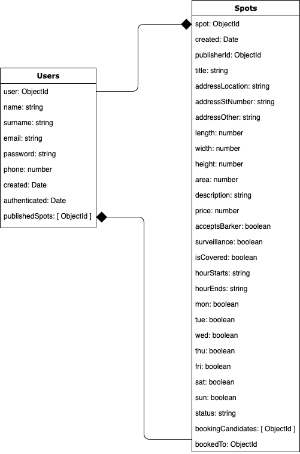
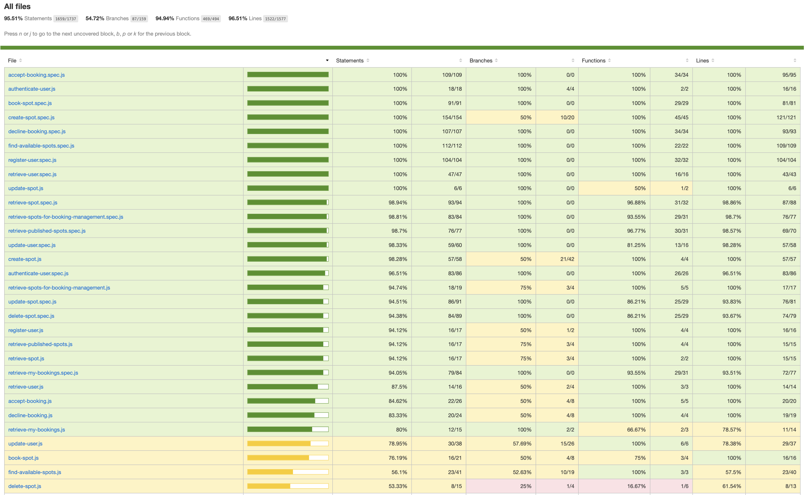

# SHARE MY SPOT APP

## INTRODUCTION
The application allows both owners and not-owners of parking spots, to be able to either switch spots with one another while they're away of their own parkings places, or to simply book an hourly-rated spot in a most convenient and fast way. This occurs in those hours of the day that the parking spot is free from its original tenant (either because the owner is at work, having some days off, or just on holidays). The idea is not only to optimize the already overpopulated parking situation of the cities, but also to get evey owner to be able to raise some money in the meantime while taking the most of their own parking spots.

## FUNCTIONAL DESCRIPTION

The user has to register and create an account in order to access the features this app has to offer. This is a private mobile only app.

Once inside the user

<ul>
    <li>Perform a search and check spots details</li>
    <li>Add a spot</li>
    <li>Check his own published spots</li>
    <li>Edit a spot</li>
    <li>Delete a spot</li>
    <li>Manage his requests (whether to accept or decline booking proposals)</li>
    <li>Book a spot (by placing a spot request to a different owner)</li>
    <li>Check his bookings once accepted for owner details</li>
</ul>

### Uses Cases

### Flows

- General Flow Chart 

    

- Activity Flows

    

    
    
    

## TECHNICAL DESCRIPTION

### Blocks

### Data Model

## Code Coverage

### Server-side

### Technologies

Javascript, ReactJS, Node.js, Express, MongoDB, Mongoose, SASS & BEM. Testing: Jest & Mocha/Chai

### Link to Trello

[SHARE-MY-SPOT-Trello](https://trello.com/invite/b/T1biXFk4/6978107c189c0ea0306c12300d4b77c9/share-my-spot)

### TODO

<ul>
    <li>Improve testing</li>
    <li>Improve styles</li>
    <li>Add more features</li>
</ul>